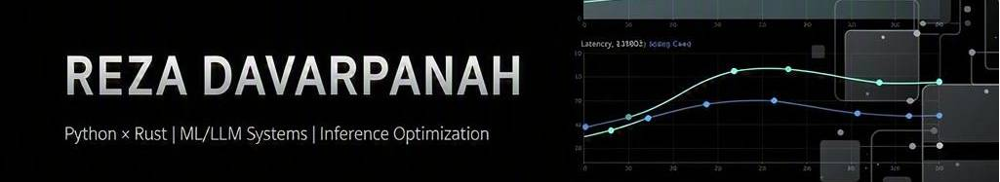

  

# Reza Davarpanah
### High-Performance AI Engineer

**I bridge the gap between heavy ML/LLM models and production runtime efficiency.**  
*I build Python-Rust hybrid runtimes to optimize execution latency, cloud spend, and system stability.*

 

[-FF5722?style=for-the-badge&logo=rss&logoColor=white)](https://parscoders.com/resume/506155/reza-davarpanah#coderTab)

---

## 🚀 Core Expertise & System Focus

- **Low-Latency Runtimes:** Designing latency-sensitive ML/LLM execution pipelines optimized for high-throughput production environments.
- **Python–Rust Integration (PyO3):** Writing high-performance Rust extensions to accelerate CPU-bound hot paths, data preprocessing, and custom feature transforms.
- **Inference Optimization:** Reducing cloud GPU/CPU footprint through hardware-aware compilation, model profiling, and efficient resource scheduling.
- **Advanced Neural Architectures:** Implementing neuromorphic computing pipelines (SNNs) and structurally sparse graph neural networks (GNNs).

---

## 🛠️ High-Performance Tech Stack

| Domain | Technologies & Frameworks |
| :--- | :--- |
| **Languages** | `Python` (High-Performance), `Rust` (Systems-level), `PyO3` / `Maturin` |
| **Deep Learning** | `PyTorch`, `PyTorch Geometric` (PyG), `BindsNET` (SNN Simulation) |
| **Systems & Infra** | `Inference Optimization`, `Data Pipeline Engineering`, `Low-Latency Runtimes` |
| **Methodologies** | `Memory Profiling`, `Hardware-Aware Acceleration`, `Graph Representation Learning` |

---

## 🔬 Featured Engineering Projects

### 1️⃣ Low-Latency Fraud Detection Graph
> **Focus: Scale & Structural Graph Optimization**

* **Stack:** PyTorch Geometric (PyG), GCN, GAT, Elliptic Bitcoin Dataset.
* **The Problem:** Processing massive, structurally sparse, and heterophilous transaction networks in real-time is highly latency-sensitive and bottlenecked by traditional data loads.
* **The Solution:** Built a graph-based pipeline optimizing the transaction feature extraction. Benchmarked advanced graph neural network (GNN) architectures against classical ML baselines to improve accuracy and speed under highly skewed and sparse transaction patterns.
* **Source:** [GitHub Repository](https://github.com/Reza-Davarpanah)

### 2️⃣ Neuromorphic EEG Seizure Detection
> **Focus: Biological Spiking Efficiency & Micro-second Latency**

* **Stack:** BindsNET, Spiking Neural Networks (SNN), STDP Learning, SVM.
* **The Problem:** Real-time EEG classification on edge devices demands ultra-low power consumption and high temporal fidelity.
* **The Solution:** Implemented a neuromorphic seizure detection workflow inspired by biologically realistic neural learning. Modeled continuous, temporal EEG dynamics utilizing unsupervised Spike-Timing-Dependent Plasticity (STDP) for feature representation, followed by a robust SVM classification layer.
* **Source:** [GitHub Repository](https://github.com/Reza-Davarpanah)

### 3️⃣ Hybrid ML-Metaheuristic Optimizer
> **Focus: Search Convergence Speedup & Complex Graph Optimization**

* **Stack:** Genetic Algorithms (GA), Particle Swarm Optimization (PSO), ML-Guided Policy.
* **The Problem:** NP-hard combinatorial optimization on large networks suffers from slow convergence and massive compute resource waste.
* **The Solution:** Engineered a hybrid optimization framework that couples classical evolutionary search (GA/PSO) with machine learning decision policies. The ML layer adaptively guides the metaheuristic exploration, drastically reducing iterations needed to converge on optimal network routing/topology solutions.
* **Source:** [GitHub Repository](https://github.com/Reza-Davarpanah)

---

## 🧠 System Philosophy

> *"Premature optimization is the root of all evil. But when you are processing millions of tokens per second or dealing with microsecond-level trading systems, latency is money. I build architectures that don't compromise between safety, speed, and cost."*

---

  Let's build something fast. Reach out via <a href="https://www.linkedin.com/in/reza-davarpanah-84951b374">LinkedIn</a> or drop an email to <a href="mailto:www.rezadavarpanah86@gmail.com">rezadavarpanah86@gmail.com</a>.

