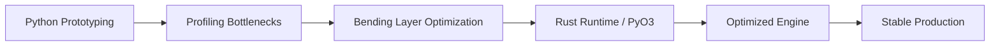

# Reza Davarpanah
### High-Performance AI Engineer | Creator of the **Bending Strategy**

I architect high-efficiency AI systems by fusing Python’s ML velocity with Rust’s runtime performance.  
From neuromorphic edge inference to graph-scale intelligence, I optimize for **latency, throughput, and cloud cost**.

 

  

---

## ⚡ About Me — The Bending Strategy

I operate at the intersection of **HPC (High-Performance Computing)** and **Applied AI**.  
My engineering philosophy is simple: I don’t just train models; I **bend** them into production constraints—compressing complexity, removing runtime bottlenecks, and maximizing efficiency per compute dollar.

My core specialization is building **Hybrid Runtimes**: Python for rapid ML iteration, Rust (via **PyO3**) for memory-safe, concurrent, low-latency execution.  
This eliminates GIL-bound bottlenecks and enables predictable scaling under real production load.

---

## 🛠 Core Engineering Expertise

- **AI Runtime Optimization:** Rust-driven execution paths for real-time inference and data preprocessing.
- **Graph + Neuromorphic Intelligence:** GNNs for topological reasoning, SNNs for temporal edge AI.
- **Extreme Compute Efficiency:** Memory reduction, CPU scaling, and elimination of Python's execution overhead.
- **Imbalance & Heterophily Mastery:** Loss-level mathematical tuning for asymmetric real-world datasets.

---

## 🧭 Bending Pipeline (The Architecture)

---

## 🚀 Featured Work

### 1) **GNN_Guided_ACO** — Hybrid Combinatorial Optimization
A high-performance engine combining GNN heuristics with Ant Colony Optimization.  
**Impact:** Migrated critical search loops to Rust, achieving thread-safe concurrency and removing GIL overhead.

### 2) **Neuromorphic EEG Engine (SNN-Seizure)**
SNN architecture (`184-input → 120-LIF`) with **PostPre STDP** feature extraction.  
**Impact:** Engineered for edge-native medical IoT. Achieved sub-5ms inference target with ~97% memory reduction.

### 3) **Elliptic-Fraud Intelligence (Graph ML)**
Advanced GNN pipeline (GCN/GAT) for Bitcoin transaction monitoring.  
**Impact:** Solved severe class imbalance and heterophily using mathematically tuned weighted objectives.

---

## 📊 Performance Benchmarks (Observed)

| Project | Stack | Performance Signal | Engineering Impact |
|---|---|---|---|
| **GNN_Guided_ACO** | PyTorch + Rust | Near-instant convergence | Hybrid-Parallel Execution |
| **SNN-Seizure** | BindsNET + STDP | **< 5ms** Inference | **~97% Memory Reduction** |
| **Elliptic-Fraud** | PyG + XGBoost | **96.35% F1-Weighted** | Robustness under imbalance |

---

## 📈 Engineering Metrics

### GitHub Stats

### Top Languages

### GitHub Streak

---

## 🔢 The Numbers Speak

- **< 5ms** target latency in edge-native SNN inference.
- **30×** throughput scaling potential by moving critical bottlenecks from Python to Rust.
- **O(V + E·H)** complexity awareness for stable graph-scale production planning.

---

## 🔗 Connect & Collaborate

[LinkedIn](https://www.linkedin.com/in/reza-davarpanah-84951b374) • [Email](mailto:rezadavarpanah86@gmail.com) • [Resume](https://parscoders.com/resume/506155/reza-davarpanah#coderTab)

  <b>Precision is not a metric; it is the infrastructure.</b>

